# Laporan Praktikum Sistem Terdistribusi dan Terdesentralisasi

## Pertemuan 01: Pengenalan Git dan GitHub

### Identitas

- Nama: **[Isi nama lengkap]**
- NIM: **[Isi NIM]**
- Kelas: **[Isi kelas]**
- Tanggal Praktikum: **[Isi tanggal]**

## 1. Tujuan

1. Memahami fungsi Git sebagai sistem pengelolaan versi.
2. Memahami fungsi GitHub sebagai layanan penyimpanan repository secara daring.
3. Mengonfigurasi Git pada komputer lokal.
4. Membuat dan mengelola repository Git.
5. Mempraktikkan proses clone, branch, commit, push, dan pull request.
6. Mendokumentasikan hasil praktikum menggunakan repository GitHub.

## 2. Dasar Teori

### 2.1 Git

Git adalah sistem version control terdistribusi yang digunakan untuk mencatat perubahan file. Git memungkinkan pengguna membuat commit, melihat riwayat perubahan, membuat branch, serta mengembalikan file ke kondisi sebelumnya.

### 2.2 GitHub

GitHub adalah layanan berbasis web yang digunakan untuk menyimpan repository Git secara remote. GitHub juga menyediakan fitur kolaborasi seperti pull request, code review, dan pengelolaan branch.

### 2.3 Istilah Penting

- **Repository**: tempat penyimpanan file dan riwayat perubahan.
- **Remote repository**: repository yang berada di server, dalam praktikum ini berada di GitHub.
- **Commit**: catatan permanen atas perubahan yang dilakukan.
- **Branch**: cabang pengembangan yang terpisah dari branch utama.
- **Push**: mengirim commit dari repository lokal ke remote repository.
- **Pull**: mengambil perubahan dari remote repository ke repository lokal.
- **Pull request**: permintaan untuk menggabungkan perubahan dari suatu branch ke branch lain.
- **Merge**: proses penggabungan perubahan dari dua branch.

## 3. Alat dan Bahan

- Komputer atau laptop.
- Git.
- Akun GitHub.
- Terminal atau command prompt.
- Text editor.
- Repository GitHub: [prak-dis-dec](https://github.com/zulangga053/prak-dis-dec).

## 4. Langkah Pengerjaan

### 4.1 Memeriksa Instalasi Git

Versi Git diperiksa menggunakan perintah berikut:

```bash
git --version
```

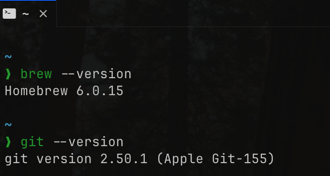

### 4.2 Mengonfigurasi Git

Identitas pengguna Git dikonfigurasi agar setiap commit memiliki informasi pembuat yang benar.

```bash
git config --global user.name "Nama Lengkap"
git config --global user.email "email-github@example.com"
git config --global init.defaultBranch main
git config --global --list
```

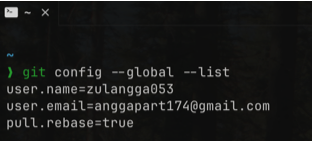

### 4.3 Membuat Repository GitHub

Repository `prak-dis-dec` dibuat pada akun GitHub untuk menyimpan laporan praktikum dari minggu pertama sampai minggu ke-14.

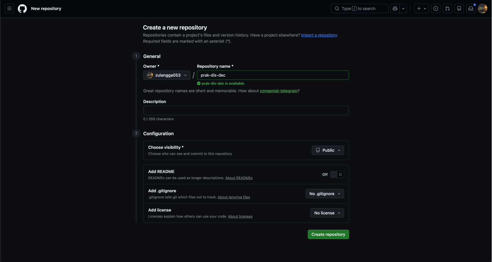

### 4.4 Melakukan Clone Repository

Repository GitHub disalin ke komputer lokal menggunakan perintah berikut:

```bash
git clone https://github.com/zulangga053/prak-dis-dec.git
cd prak-dis-dec
```

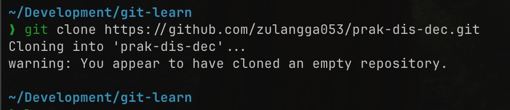

### 4.5 Memeriksa Remote Repository

Remote repository diperiksa untuk memastikan repository lokal terhubung ke GitHub.

```bash
git remote -v
```

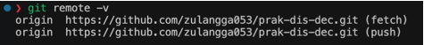

### 4.6 Memeriksa Status dan Branch

Status repository dan branch yang aktif diperiksa menggunakan perintah berikut:

```bash
git status
git branch
```

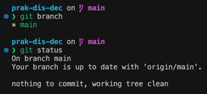

### 4.7 Membuat Branch Praktikum

Branch baru dibuat sebagai tempat melakukan latihan perubahan tanpa langsung bekerja pada branch `main`.

```bash
git switch -c latihan-git
```

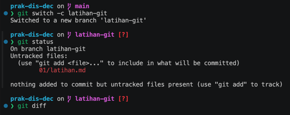

### 4.8 Menambahkan Perubahan dan Membuat Commit

Perubahan ditambahkan ke staging area, kemudian disimpan sebagai commit.

```bash
git add .
git commit -m "docs: add git practice file"
git log --oneline
```

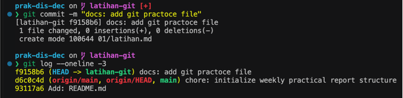

### 4.9 Mengirim Branch ke GitHub

Branch hasil latihan dikirim ke remote repository menggunakan perintah berikut:

```bash
git push -u origin latihan-git
```

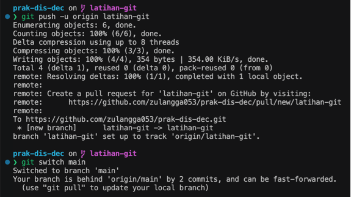

### 4.10 Membuat Pull Request

Pull request dibuat untuk mengusulkan penggabungan perubahan dari branch `latihan-git` ke branch utama pada GitHub.

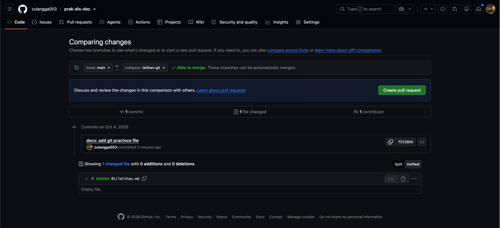

### 4.11 Memeriksa Branch Utama Setelah Pull Request

Setelah proses pull request, kondisi branch utama diperiksa untuk memastikan perubahan telah diproses pada repository.

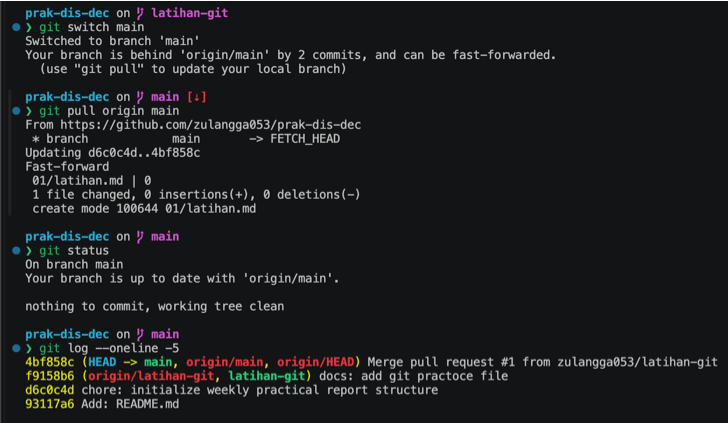

## 5. Hasil Praktikum

Hasil yang diperoleh:

1. Git berhasil diperiksa dan digunakan pada komputer lokal.
2. Identitas Git berhasil dikonfigurasi.
3. Repository `prak-dis-dec` berhasil dibuat dan digunakan.
4. Repository GitHub berhasil di-clone ke komputer lokal.
5. Remote `origin` berhasil terhubung ke repository GitHub.
6. Branch `latihan-git` berhasil dibuat.
7. Perubahan berhasil di-commit.
8. Branch latihan berhasil di-push ke GitHub.
9. Pull request berhasil dibuat untuk mengusulkan penggabungan perubahan ke branch utama.
10. Bukti pengerjaan tersimpan pada direktori `01/images/`.

## 6. Analisis

Praktikum menunjukkan bahwa Git digunakan untuk mengelola perubahan pada repository lokal, sedangkan GitHub digunakan sebagai remote repository untuk menyimpan dan membagikan perubahan secara daring. Perubahan tidak langsung masuk ke repository remote setelah file diedit. Perubahan perlu diperiksa, dimasukkan ke staging area menggunakan `git add`, disimpan sebagai commit menggunakan `git commit`, kemudian dikirim ke GitHub menggunakan `git push`.

Penggunaan branch memungkinkan pekerjaan dilakukan secara terpisah dari branch `main`. Dengan demikian, perubahan dapat ditinjau terlebih dahulu melalui pull request sebelum digabungkan. Alur ini membantu menjaga branch utama tetap terkontrol dan mendukung kolaborasi dalam pengembangan perangkat lunak.

## 7. Kendala dan Solusi

| Kendala | Solusi |
|---|---|
| Belum memahami perbedaan repository lokal dan remote | Mempelajari hubungan antara repository lokal, `origin`, `push`, dan `pull` |
| Perubahan belum terlihat di GitHub | Memeriksa `git status`, membuat commit, lalu menjalankan `git push` |
| Perlu memisahkan perubahan dari branch utama | Membuat branch baru menggunakan `git switch -c` |
| Perlu menggabungkan perubahan secara terkontrol | Membuat pull request melalui GitHub |

## 8. Kesimpulan

Git dan GitHub memiliki peran penting dalam pengelolaan perubahan dan kolaborasi pengembangan perangkat lunak. Git digunakan untuk mencatat perubahan pada repository lokal, sedangkan GitHub digunakan untuk menyimpan repository secara remote. Melalui praktikum ini, proses konfigurasi Git, clone repository, pembuatan branch, commit, push, dan pull request berhasil dipelajari serta didokumentasikan.

## 9. Referensi

1. [Petunjuk Penggunaan Git dan GitHub](https://github.com/NEO-X-School/notes/tree/main/petunjuk-git-github)
2. [Git Documentation](https://git-scm.com/doc)
3. [GitHub Documentation](https://docs.github.com/)
