# Laporan Praktikum Sistem Terdistribusi dan Terdesentralisasi

## Pertemuan 02: Komunikasi Antarproses pada Sistem Terdistribusi

### Identitas

- Nama: **Zul Ikhwanul Anggara**
- NIM: **255410043**
- Kelas: **Informatika-1**
- Tanggal Praktikum: **8 October 2026**

## 1. Tujuan

Praktikum ini bertujuan untuk:

1. Menampilkan proses yang sedang berjalan pada sistem operasi.
2. Menjalankan aplikasi dan menemukan proses yang dibuat oleh aplikasi tersebut.
3. Memahami cara menghentikan proses menggunakan PID.
4. Memahami perbedaan penghentian proses biasa dan penghentian proses secara paksa.
5. Menyiapkan GraphQL server menggunakan Python dan Strawberry.
6. Membuat client yang dapat mengakses GraphQL server.
7. Mengamati komunikasi antara client dan server melalui request GraphQL.

## 2. Dasar Teori

Proses adalah program yang sedang berjalan dan dikelola oleh sistem operasi. Setiap proses memiliki identitas berupa process ID atau PID. Selain kode program, proses juga menggunakan resources seperti memori, CPU, dan file yang sedang dibuka.

Pada satu komputer atau node, sistem operasi bertanggung jawab mengatur pembuatan, penjadwalan, dan penghentian proses. Proses dapat dihentikan dengan mengirimkan signal berdasarkan PID. Pada sistem Unix-like seperti macOS dan Linux, perintah `kill` digunakan untuk mengirimkan signal tersebut. Jika proses tidak berhenti secara normal, proses dapat dihentikan secara paksa menggunakan `kill -9`.

Komunikasi antarproses pada sistem terdistribusi memiliki tantangan yang berbeda. Proses yang berada pada node berbeda tidak dapat menggunakan shared memory secara langsung. Komunikasi dilakukan melalui jaringan menggunakan mekanisme client-server. Dalam praktikum ini, GraphQL digunakan sebagai antarmuka komunikasi. Client mengirimkan query kepada server, kemudian server memproses query dan mengembalikan response dalam format JSON.

## 3. Alat dan Bahan

- Komputer dengan sistem operasi macOS.
- Terminal.
- Python 3.14.8.
- `uv` untuk mengelola Python dan virtual environment.
- Strawberry GraphQL.
- Uvicorn sebagai ASGI server.
- Browser.
- Editor kode.

## 4. Langkah Pengerjaan

### 4.1 Menampilkan proses pada komputer

Langkah pertama dilakukan dengan menampilkan daftar proses yang sedang berjalan pada komputer. Proses tersebut dikelola oleh sistem operasi dan setiap proses memiliki PID masing-masing.

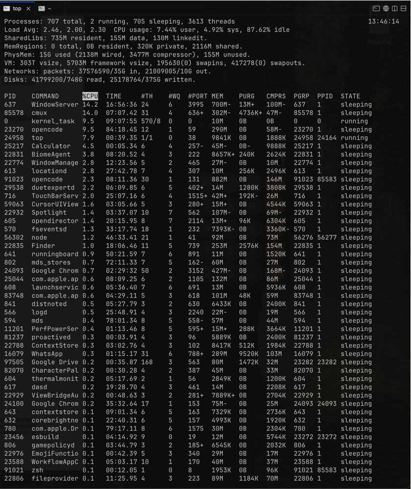

Dari daftar tersebut dapat dilihat bahwa sistem sedang menjalankan berbagai proses sistem maupun aplikasi pengguna.

### 4.2 Menjalankan aplikasi

Salah satu aplikasi dijalankan untuk melihat proses yang dibuat oleh aplikasi tersebut.

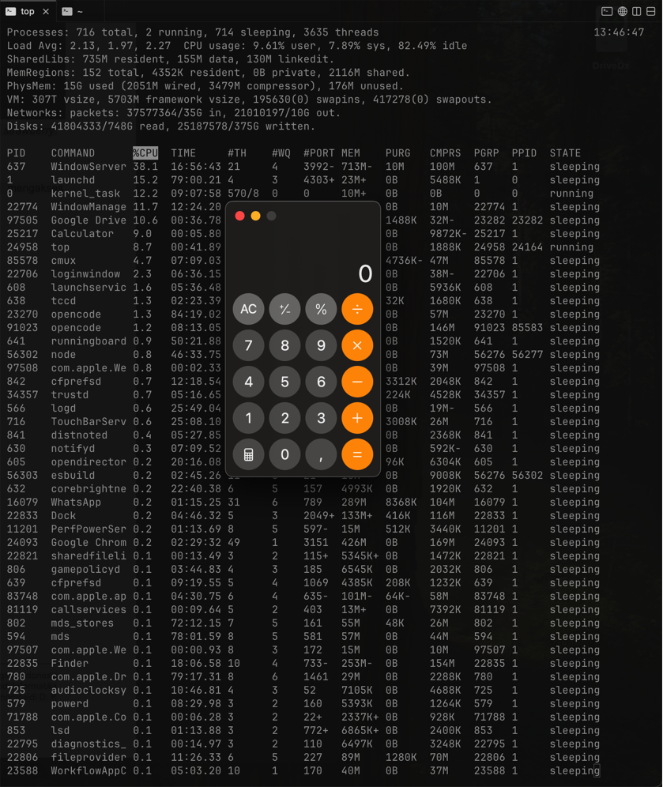

Setelah aplikasi berjalan, proses aplikasi dicari menggunakan nama aplikasi atau PID yang ditampilkan oleh sistem.

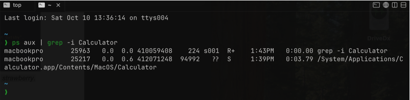

PID digunakan sebagai identitas proses saat menjalankan perintah untuk menghentikan proses.

### 4.3 Menghentikan proses berdasarkan PID

Proses aplikasi dihentikan menggunakan perintah `kill` dengan PID proses yang telah ditemukan. Cara ini tidak menggunakan menu keluar dari aplikasi, tetapi langsung mengirimkan signal kepada proses melalui sistem operasi.

```bash
kill <PID>
```

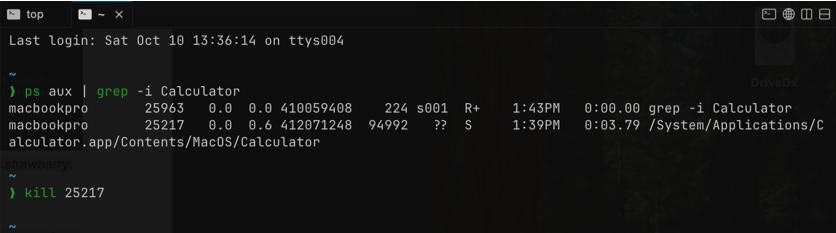

Setelah perintah dijalankan, proses aplikasi diperiksa kembali untuk memastikan proses sudah tidak berjalan.

### 4.4 Menghentikan proses secara paksa

Jika proses tidak berhenti menggunakan signal biasa, proses dapat dihentikan secara paksa menggunakan signal `SIGKILL`.

```bash
kill -9 <PID>
```

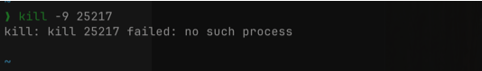

Perintah tersebut menghentikan proses secara langsung. Karena proses tidak diberi kesempatan melakukan pembersihan secara normal, penggunaannya dilakukan hanya jika penghentian biasa tidak berhasil.

### 4.5 Menjalankan kembali aplikasi

Setelah proses dihentikan, aplikasi dijalankan kembali untuk memastikan aplikasi dapat dibuat sebagai proses baru.

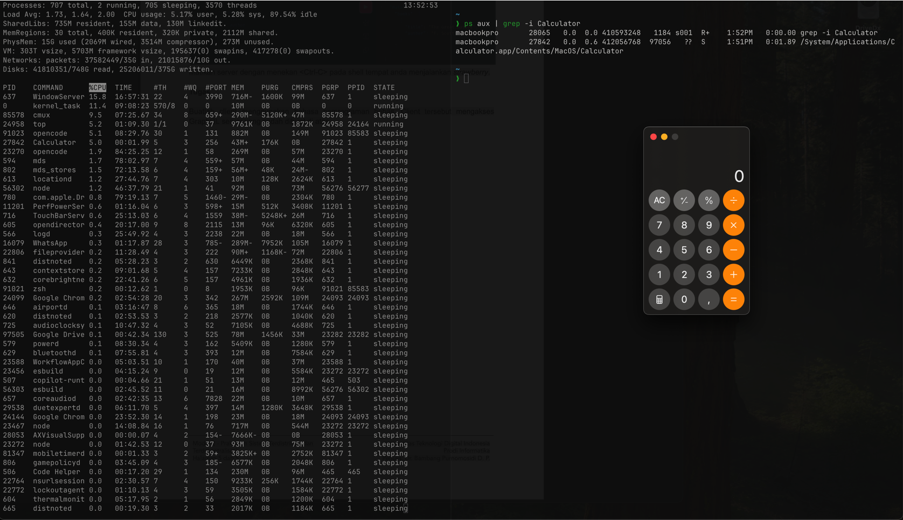

Pada saat dijalankan kembali, aplikasi dapat memperoleh PID baru. Hal ini menunjukkan bahwa PID melekat pada proses tertentu, bukan bersifat tetap untuk aplikasi.

### 4.6 Memeriksa dan menyiapkan `uv`

`uv` digunakan untuk mengelola versi Python, virtual environment, dan paket yang diperlukan. Ketersediaan `uv` diperiksa melalui terminal.

```bash
uv --version
```


Workspace praktikum kemudian dibuat dengan nama `workspace-01`.

```bash
mkdir workspace-01
cd workspace-01
uv python install 3.14
uv venv --python 3.14
source .venv/bin/activate
```


Virtual environment digunakan agar paket praktikum terisolasi dari instalasi Python global.

### 4.7 Instalasi Strawberry GraphQL

Paket Strawberry GraphQL diinstal menggunakan `uv`.

```bash
uv pip install 'strawberry-graphql[cli]'
```

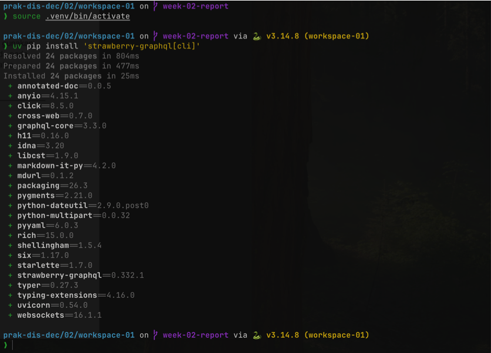

### 4.8 Membuat GraphQL schema

File `schema.py` dibuat di dalam direktori `workspace-01`. File ini mendefinisikan tipe data buku, query `books`, schema GraphQL, dan aplikasi ASGI.

```python
import strawberry
from strawberry.asgi import GraphQL


@strawberry.type
class Book:
    title: str
    author: str


@strawberry.type
class Query:
    @strawberry.field
    def books(self) -> list[Book]:
        return [
            Book(title="Distributed Systems", author="Andrew S. Tanenbaum"),
            Book(title="The Pragmatic Programmer", author="David Thomas"),
        ]


schema = strawberry.Schema(query=Query)
app = GraphQL(schema)
```

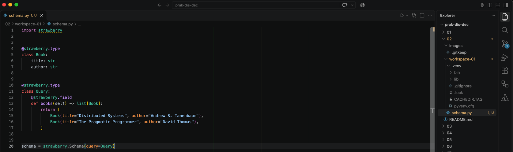

### 4.9 Menjalankan GraphQL server

Pada awalnya dicoba menjalankan server dengan perintah berikut:

```bash
strawberry server schema
```

Namun perintah tersebut menghasilkan pesan `No such command 'server'`. Kendala tersebut terjadi karena versi Strawberry yang terpasang tidak menyediakan subcommand `server`.


Sebagai solusi, aplikasi GraphQL dijalankan menggunakan Uvicorn melalui objek `app` yang telah dibuat di `schema.py`.

```bash
uvicorn schema:app --host 127.0.0.1 --port 8000
```


### 4.10 Mengakses server melalui browser

GraphQL server diakses melalui alamat berikut:

```text
http://127.0.0.1:8000/graphql
```

Query berikut dimasukkan pada GraphQL interface:

```graphql
{
  books {
    title
    author
  }
}
```

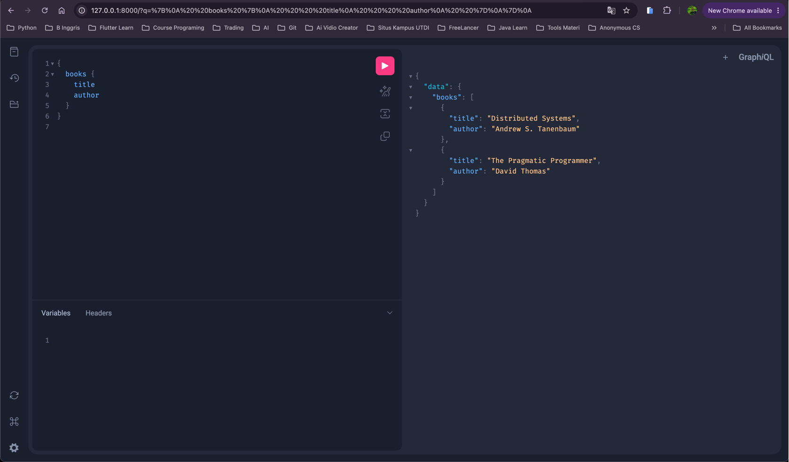

Server mengembalikan daftar buku beserta judul dan penulisnya.

### 4.11 Menguji request dengan `curl`

Selain melalui browser, endpoint GraphQL diuji menggunakan request HTTP dari terminal.

```bash
curl -X POST http://127.0.0.1:8000/graphql \
  -H "Content-Type: application/json" \
  -d '{"query":"{ books { title author } }"}'
```

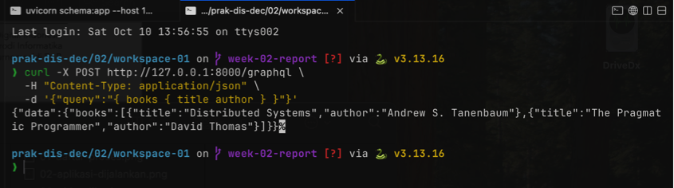

Pengujian ini menunjukkan bahwa server dapat menerima request dari client HTTP.

### 4.12 Menghentikan GraphQL server

Server dihentikan dari terminal tempat server berjalan dengan menekan `Ctrl-C`.

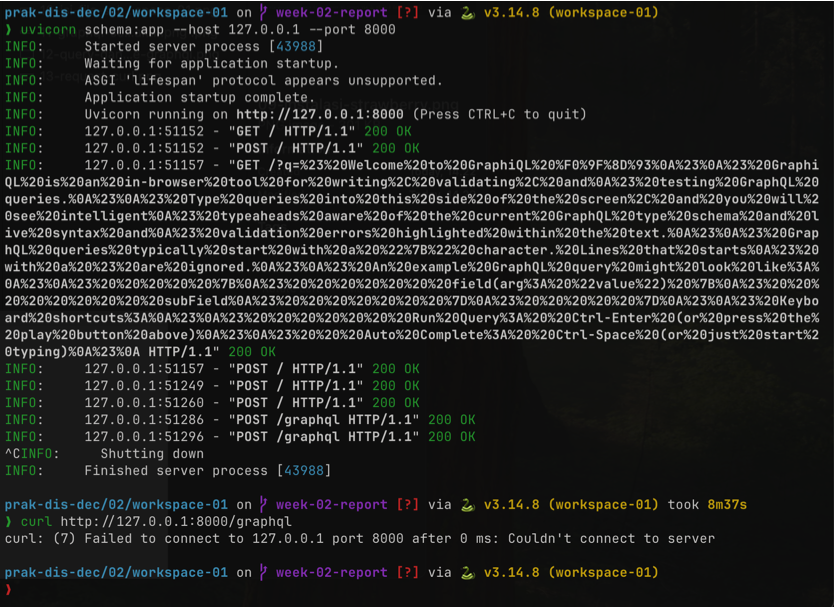

## 5. Pengerjaan Tugas: Membuat Client GraphQL

### 5.1 Membuat file `client.py`

Client dibuat menggunakan Python standard library. Dengan cara ini tidak diperlukan paket tambahan untuk mengirim request HTTP.

File dibuat pada lokasi:

```text
02/workspace-01/client.py
```

Isi file `client.py`:

```python
import json
from urllib.request import Request, urlopen


GRAPHQL_URL = "http://127.0.0.1:8000/graphql"

query = """
{
  books {
    title
    author
  }
}
"""

payload = json.dumps({"query": query}).encode("utf-8")

request = Request(
    GRAPHQL_URL,
    data=payload,
    headers={"Content-Type": "application/json"},
    method="POST",
)

with urlopen(request) as response:
    result = json.loads(response.read().decode("utf-8"))

print(json.dumps(result, indent=2))
```

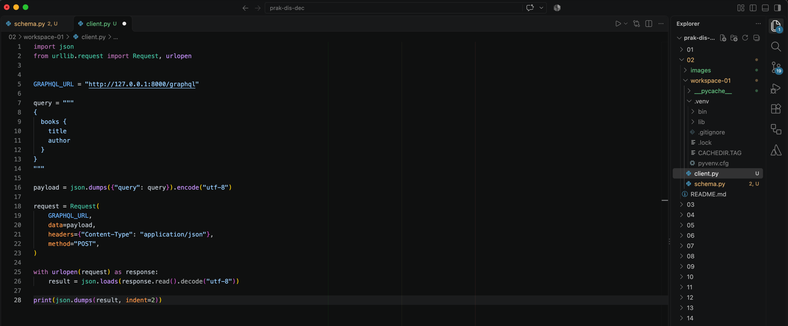

Client menggunakan metode `POST` karena query dikirimkan ke server sebagai data JSON. Endpoint yang digunakan sama dengan endpoint GraphQL pada browser.

### 5.2 Menjalankan server untuk client

Server dijalankan kembali menggunakan perintah berikut:

```bash
uvicorn schema:app --host 127.0.0.1 --port 8000
```

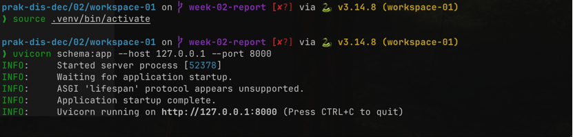

### 5.3 Menjalankan client

Pada terminal lain, virtual environment diaktifkan kemudian client dijalankan.

```bash
source .venv/bin/activate
python client.py
```

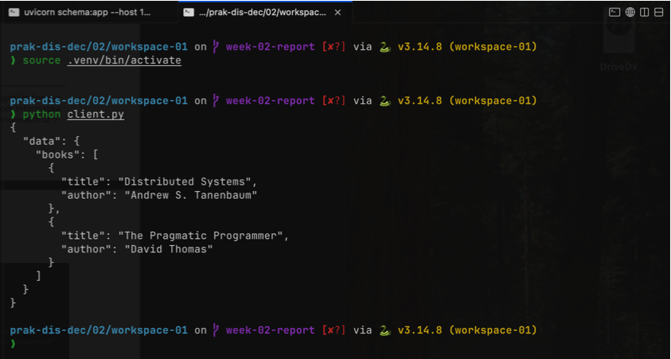

Response yang diterima client berbentuk JSON:

```json
{
  "data": {
    "books": [
      {
        "title": "Distributed Systems",
        "author": "Andrew S. Tanenbaum"
      },
      {
        "title": "The Pragmatic Programmer",
        "author": "David Thomas"
      }
    ]
  }
}
```

### 5.4 Mengamati request pada server

Setelah client dijalankan, terminal server menunjukkan bahwa terdapat request yang diterima dari client.

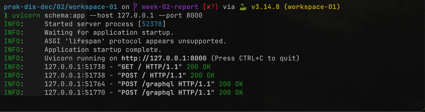

Hal ini membuktikan bahwa client dan server berhasil berkomunikasi melalui endpoint GraphQL.

### 5.5 Menguji kondisi server tidak aktif

Server dihentikan, kemudian `client.py` dijalankan kembali. Client tidak dapat memperoleh data karena tidak ada server yang menerima request.

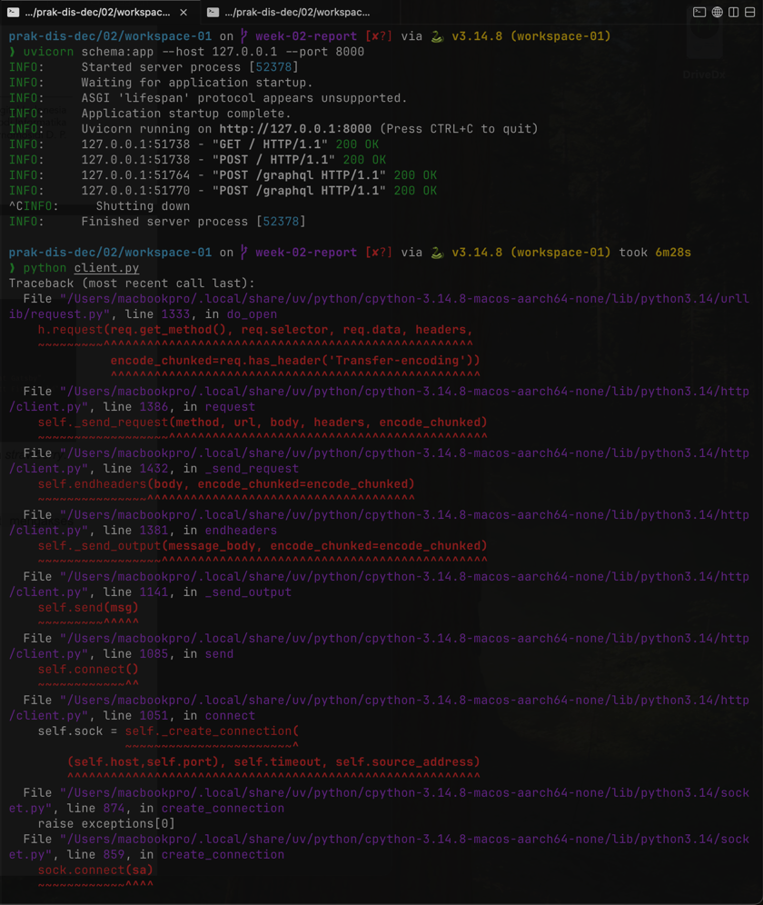

Pengujian tersebut menunjukkan bahwa client memerlukan server yang aktif agar request dapat diproses.

### 5.6 Menjalankan kembali server dan client

Server dijalankan kembali, kemudian client dijalankan ulang. Setelah server aktif, request kembali berhasil diproses dan data buku dapat diterima client.

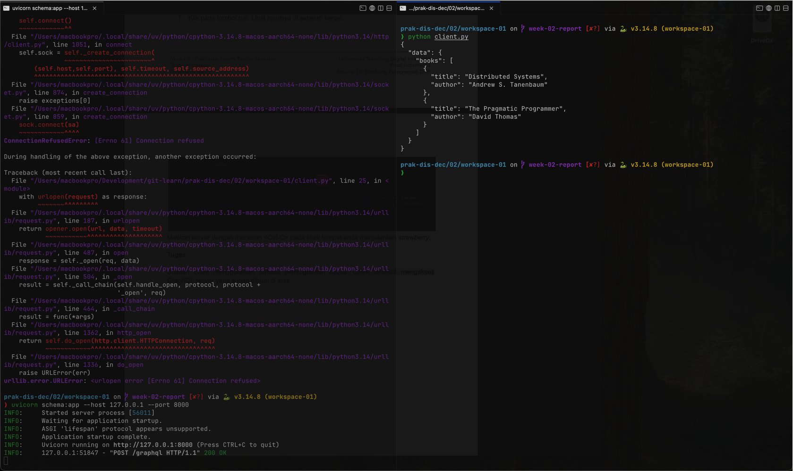

## 6. Hasil Praktikum

Hasil yang diperoleh dari praktikum ini adalah:

1. Berhasil menampilkan proses yang berjalan pada komputer.
2. Berhasil menjalankan aplikasi dan menemukan PID prosesnya.
3. Berhasil menghentikan proses menggunakan perintah `kill`.
4. Berhasil menghentikan proses secara paksa menggunakan `kill -9`.
5. Berhasil menjalankan kembali aplikasi setelah proses dihentikan.
6. Berhasil membuat workspace Python menggunakan `uv` dan Python 3.14.
7. Berhasil menginstal Strawberry GraphQL.
8. Berhasil membuat schema GraphQL dengan query `books`.
9. Berhasil menjalankan GraphQL server menggunakan Uvicorn.
10. Berhasil menjalankan query melalui browser dan `curl`.
11. Berhasil membuat client Python menggunakan standard library.
12. Berhasil memperoleh data buku dari GraphQL server melalui client.
13. Berhasil membuktikan bahwa client gagal terhubung ketika server dihentikan.
14. Berhasil menghubungkan kembali client setelah server dijalankan ulang.

## 7. Analisis

Pada bagian pertama, proses aplikasi dapat diamati dan dikendalikan menggunakan fasilitas sistem operasi. PID menjadi penanda penting karena perintah penghentian proses ditujukan kepada PID tertentu. Ketika aplikasi dijalankan kembali, PID dapat berubah karena sistem operasi membuat proses baru.

Perintah `kill` digunakan untuk meminta proses berhenti. Jika proses tidak merespons, `kill -9` dapat digunakan untuk memaksa proses berhenti. Penghentian paksa sebaiknya tidak menjadi pilihan pertama karena proses tidak memiliki kesempatan untuk menutup resource secara normal.

Pada bagian GraphQL, komunikasi tidak dilakukan melalui shared memory. Client mengirimkan request HTTP berisi query kepada server. Server membaca query, mengambil data dari resolver `books`, lalu mengirimkan response JSON. Browser, `curl`, dan `client.py` dapat bertindak sebagai client yang berbeda selama mengikuti endpoint dan format request yang benar.

Pengujian saat server tidak aktif memperlihatkan ketergantungan client terhadap server. Client tidak bisa menghasilkan data sendiri karena data dan pemrosesan query berada pada server. Kondisi ini menggambarkan prinsip komunikasi antarproses pada sistem terdistribusi, walaupun praktik dilakukan pada satu komputer menggunakan alamat loopback `127.0.0.1`.

## 8. Kendala dan Solusi

| Kendala | Solusi |
|---|---|
| Perintah `strawberry server schema` menghasilkan `No such command 'server'`. | Menjalankan aplikasi menggunakan `uvicorn schema:app --host 127.0.0.1 --port 8000`. | 
| Client tidak dapat terhubung ketika server dihentikan. | Menjalankan kembali GraphQL server sebelum menjalankan `client.py`. |
| Virtual environment harus digunakan agar paket praktikum ditemukan. | Menjalankan `source .venv/bin/activate` sebelum menjalankan server atau client. |
| Penghentian proses perlu dilakukan tanpa tombol keluar aplikasi. | Mencari PID kemudian menggunakan perintah `kill` atau `kill -9`. |

## 9. Kesimpulan

Praktikum ini memberikan pemahaman tentang pengelolaan proses pada satu node dan komunikasi antarproses melalui mekanisme client-server. Proses aplikasi dapat ditemukan menggunakan PID, dihentikan dengan `kill`, serta dihentikan secara paksa dengan `kill -9` jika diperlukan.

Pada bagian komunikasi terdistribusi, GraphQL digunakan untuk menghubungkan client dengan server. GraphQL server berhasil dibuat menggunakan Strawberry dan dijalankan dengan Uvicorn. Client Python berhasil mengirim query `books` dan menerima response berupa data buku. Pengujian ketika server dihentikan juga memperlihatkan bahwa client membutuhkan server aktif agar komunikasi dapat berlangsung.

## 10. Referensi

1. Modul 2 Praktikum Sistem Terdistribusi dan Terdesentralisasi, Universitas Teknologi Digital Indonesia.
2. [Strawberry GraphQL Documentation](https://strawberry.rocks/)
3. [Python Documentation](https://docs.python.org/3/)
4. [Uvicorn Documentation](https://www.uvicorn.org/)
5. [uv Documentation](https://docs.astral.sh/uv/)
